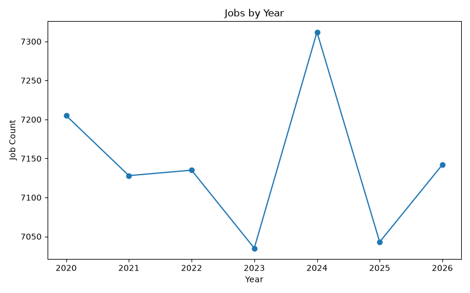
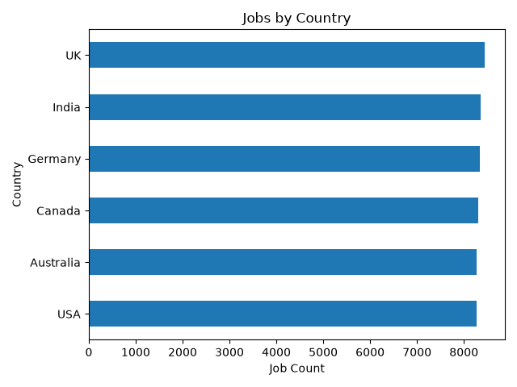
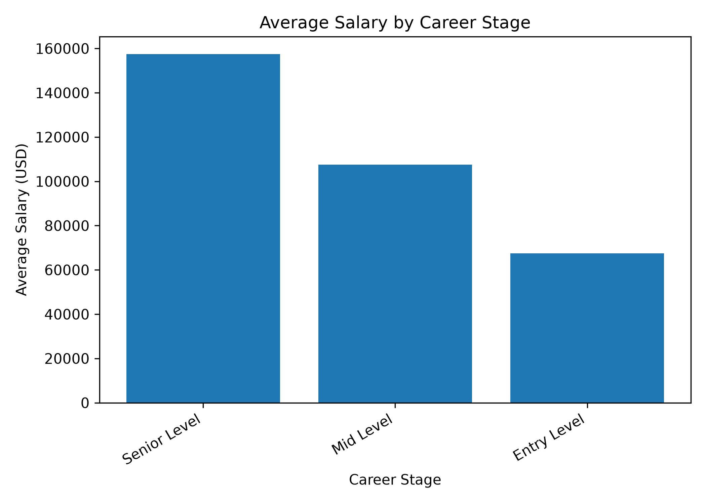
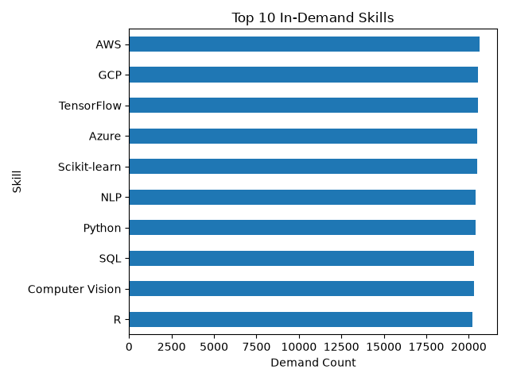
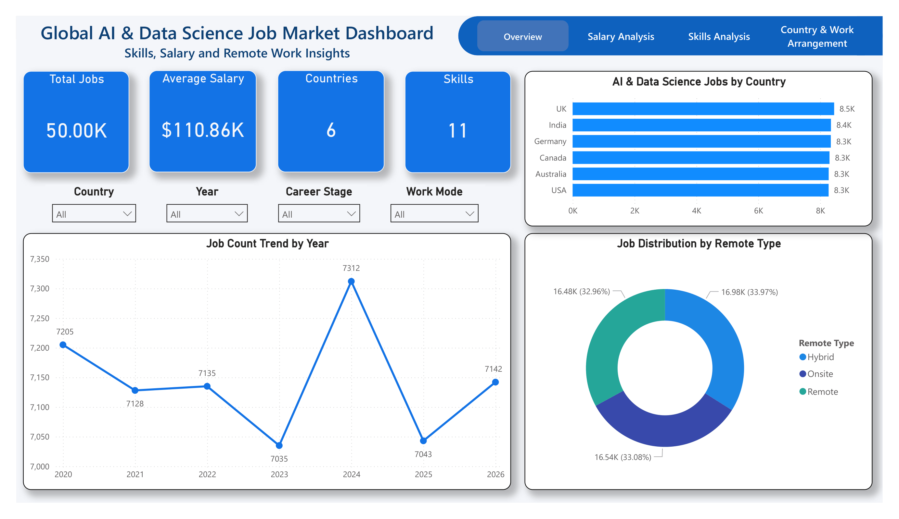
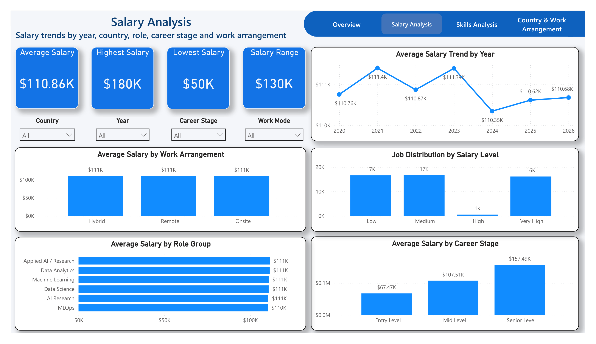
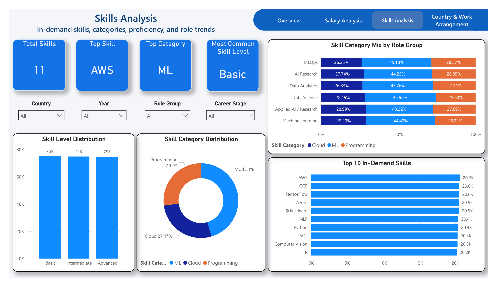
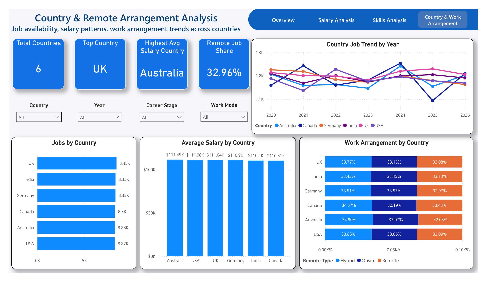

# Global AI & Data Science Job Market, Skills & Salary Trends

## Project Objective

This project analyzes global AI and Data Science job market trends using Python and Power BI. It focuses on job demand, salary patterns, technical skills, career stages, countries, and remote/hybrid/onsite work arrangements.

The final deliverable is an interactive Power BI dashboard supported by a reproducible Python workflow for cleaning, feature engineering, exploratory analysis, chart generation, and dashboard-ready CSV exports.

---

## Dataset Description

The project uses CSV datasets covering AI and Data Science job postings, skill demand, country-level trends, job title mappings, and dataset metadata.

| Dataset | Description |
|---|---|
| `data/raw/ai_jobs.csv` | Job postings with role, country, salary, experience, industry, company, and work arrangement fields |
| `data/raw/skills_demand.csv` | Skills linked to job postings, categories, and skill levels |
| `data/raw/country_ai_trends.csv` | Country-level job, salary, remote share, and skill trend data |
| `data/raw/job_title_mapping.csv` | Mapping table for grouping job titles |
| `data/raw/data_dictionary.csv` | Column definitions and dataset notes |

---

## Tools Used

| Area | Tools |
|---|---|
| Programming | Python |
| Analysis | pandas, NumPy |
| Visualization | Matplotlib |
| Dashboard | Power BI Desktop |
| Notebook | Jupyter |
| Version Control | Git, GitHub |

---

## Workflow

```text
Raw Data
   ↓
Data Loading
   ↓
Data Cleaning and Validation
   ↓
Feature Engineering
   ↓
Exploratory Data Analysis
   ↓
Chart and Table Export
   ↓
Power BI Data Preparation
   ↓
Interactive Dashboard Development
   ↓
Insights and Reporting
```

Run the scripts in this order from the project root:

```bash
python scripts/data_cleaning.py
python scripts/feature_engineering.py
python scripts/eda_analysis.py
python scripts/export_powerbi_data.py
```
---

## Python EDA Visualizations

Python and Matplotlib were used to create supporting EDA charts before building the Power BI dashboard.

### Jobs by Year


### Jobs by Country


### Salary by Career


### Top Skills


---

## Dashboard Pages

| Page | Focus |
|---|---|
| Overview | Job volume, countries, salary summary, yearly trend, and work arrangement mix |
| Salary Analysis | Salary by year, role group, career stage, country, and work arrangement |
| Skills Analysis | Top skills, skill categories, skill levels, and skill demand patterns |
| Country & Work Arrangement | Country comparisons, remote share, salary, and job distribution |

---

## Main Insights

- AI and Data Science jobs show broad global demand across multiple countries.
- Python, SQL, cloud platforms, machine learning frameworks, and NLP-related skills appear strongly in the skills data.
- Senior-level roles generally show higher average salaries than entry-level and mid-level roles.
- Remote, hybrid, and onsite work arrangements all remain relevant in the job market.
- Country-level analysis helps compare job availability, salary differences, and work arrangement patterns.

---

## Screenshots

### Overview



### Salary Analysis



### Skills Analysis



### Country & Work Arrangement



---

## How to Run the Project

1. Clone the repository.

```bash
git clone https://github.com/your-username/global-ai-data-science-skills-salary-trends.git
cd global-ai-data-science-skills-salary-trends
```

2. Create and activate a virtual environment.

```bash
python -m venv venv
venv\Scripts\activate
```

For macOS/Linux:

```bash
source venv/bin/activate
```

3. Install dependencies.

```bash
pip install -r requirements.txt
```

4. Run the pipeline.

```bash
python scripts/data_cleaning.py
python scripts/feature_engineering.py
python scripts/eda_analysis.py
python scripts/export_powerbi_data.py
```

5. Open the Power BI dashboard.

```text
powerbi/AI_Data_Science_Job_Market_Dashboard.pbix
```

---

## Folder Structure

```text
charith-01-global-ai-data-science-skills-and-salary-trends/
|-- README.md
|-- requirements.txt
|-- data/
|   |-- raw/
|   |-- processed/
|   |   |-- analysis_tables/
|-- images/
|   |-- charts/
|   |-- dashboard/
|-- notebooks/
|-- powerbi/
|   |-- data/
|-- scripts/
|   |-- data_cleaning.py
|   |-- feature_engineering.py
|   |-- eda_analysis.py
|   |-- export_powerbi_data.py
```
---

## Project Outcome

This project demonstrates an end-to-end analytics workflow from raw CSV files to a Power BI dashboard. It is designed as a portfolio project showing data preparation, exploratory analysis, dashboard data modeling support, and insight communication.
